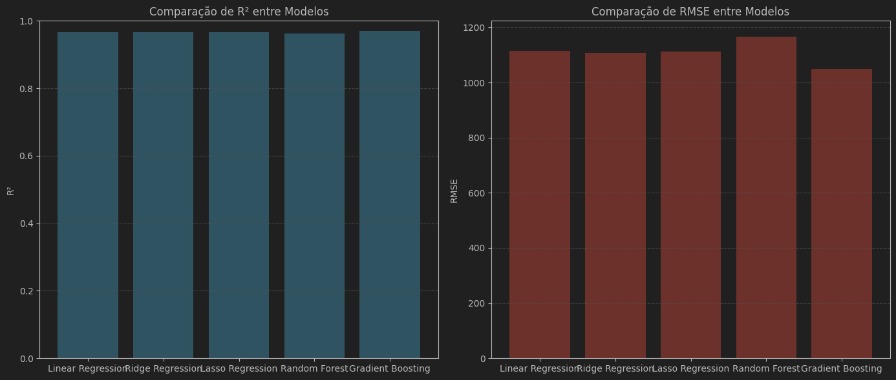

# Pós Tech Challenge FIAP - Fase 1

Este projeto desenvolve um modelo preditivo de regressão para estimar os custos médicos individuais cobrados pelo seguro de saúde, conforme desafio proposto na Fase 1 do Pós Tech da FIAP.

## Integrantes do grupo

- Carlos Adriano rm360725
- Daniel Kiluange rm362631
- Leonardo Nogueira rm362611

## Objetivo

Construir um modelo capaz de prever os encargos médicos a partir das características dos clientes, utilizando técnicas de aprendizado supervisionado.

## Estrutura do Projeto

- `atividade.ipynb`: Notebook principal com todo o passo a passo do desenvolvimento, análise e avaliação do modelo.
- `dataset.csv`: Bases de dados utilizadas para análise e modelagem com 100.000 registros.
- `definitions.md`: Descrição do desafio, tarefas, dicionário de dados e critérios de avaliação.
- `requirements.txt`/`Pipfile`: Dependências do projeto.

## Passos Realizados

1. **Exploração dos Dados**
   - Carregamento e análise das características do dataset.
   - Estatísticas descritivas.

2. **Pré-processamento**
   - Limpeza dos dados e tratamento de valores ausentes.
   - Conversão de variáveis categóricas para formatos numéricos.
   - Visualização da distribuição dos dados
     

3. **Modelagem**
   - Separação dos dados em treino e teste (70/30).
   - Criação de pipeline de pré-processamento e regressão linear.
      - Foram utilizados os seguintes modelos de treinamento
        - Linear Regression
        - Ridge Regression
        - Lasso Regression
        - Random Forest
        - Gradient Boosting

4. **Treinamento e Avaliação**
   - Treinamento dos modelos.
   - Avaliação com métricas: R², MAE, RMSE, MAPE.
```shell
Training Linear Regression model...
Métricas no conjunto de treino:
  R²: 0.9657
  MAE: 884.9847
  RMSE: 1113.6585
  MAPE: 10.0939
Métricas no conjunto de teste:
  R²: 0.9657
  MAE: 887.3936
  RMSE: 1115.5395
  MAPE: 9.9928
  
Training Ridge Regression model...
Métricas no conjunto de treino:
  R²: 0.9656
  MAE: 887.6186
  RMSE: 1116.7374
  MAPE: 10.0906
Métricas no conjunto de teste:
  R²: 0.9658
  MAE: 881.5010
  RMSE: 1108.2738
  MAPE: 10.0186
  
Training Lasso Regression model...
Métricas no conjunto de treino:
  R²: 0.9655
  MAE: 886.4649
  RMSE: 1115.0621
  MAPE: 10.1014
Métricas no conjunto de teste:
  R²: 0.9661
  MAE: 883.7923
  RMSE: 1112.3199
  MAPE: 9.9594
  
Training Random Forest model...
Métricas no conjunto de treino:
  R²: 0.9939
  MAE: 362.4997
  RMSE: 469.0830
  MAPE: 4.2281
Métricas no conjunto de teste:
  R²: 0.9623
  MAE: 925.3305
  RMSE: 1165.1633
  MAPE: 10.8235
  
Training Gradient Boosting model...
Métricas no conjunto de treino:
  R²: 0.9699
  MAE: 832.9852
  RMSE: 1045.1694
  MAPE: 9.7229
Métricas no conjunto de teste:
  R²: 0.9694
  MAE: 836.3697
  RMSE: 1049.3995
  MAPE: 9.7955
   ```
   - Seleçao do modelo com melhores avaliações métricas
     - Resultado dos modelos
       
   - Visualização dos resultados:
     - gráficos de dispersão comparando valores reais vs previstos
       
     - resíduos
       

5. **Análise de características**
   - Após o treinamento é coletada a informação das características mais relevantes.
   - 
   - As características fumante e idade foram classificadas como as mais relevantes, e com elas fizemos uma simulação dos encargos para os dois grupos
   - 
   - Percebe-se o mesmo comportamento na base testada
   - 

## Dicionário de Dados

- **idade**: Idade do cliente (numérico)
- **genero**: Gênero (`masculino`, `feminino`)
- **imc**: Índice de Massa Corporal
- **fumante**: Se é fumante (`sim`, `não`)
- **regiao**: Região de residência (`norte`, `nordeste`, `centro-oeste`, `sudeste`, `sul`)
- **encargos**: Valor cobrado pelo seguro (target)

## Como Executar

1. Instale as dependências:
   ```sh
   pip install -r requirements.txt
   ```
2. Abra o arquivo atividade.ipynb no Jupyter ou no VSCode e execute as células sequencialmente.

## Resultados
- O modelo apresenta métricas de desempenho e gráficos comparando valores reais vs. previstos, além de análise dos resíduos.
- O pipeline permite fácil adaptação para novos dados.

## Entregáveis
- Código-fonte do projeto e notebook.
- Vídeo explicativo (até 10 minutos) demonstrando o passo a passo, análise e resultados.

## Referências
- definitions.md: Detalhamento do desafio e critérios de avaliação.
- dataset.csv: Base de dados principal.

